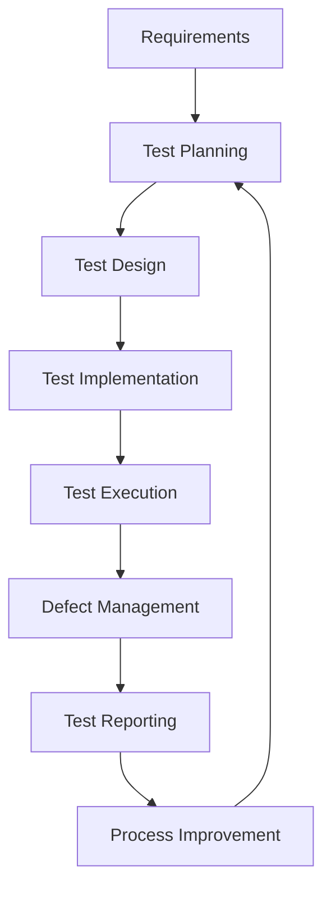

# Health API QA Framework - Estratégia de QA

**Versão**: 1.0.0  
**Data**: Janeiro 2025  
**Responsável**: QA Engineering Team  
**Status**: Ativo

---

## Índice

1. [Visão Estratégica](#visão-estratégica)
2. [Princípios de Qualidade](#princípios-de-qualidade)
3. [Abordagem de QA](#abordagem-de-qa)
4. [Framework de Qualidade](#framework-de-qualidade)
5. [Processo de QA](#processo-de-qa)
6. [Automação de Testes](#automação-de-testes)
7. [Métricas e KPIs](#métricas-e-kpis)
8. [Governança de Qualidade](#governança-de-qualidade)

---

## Visão Estratégica

### Missão da QA
> **"Garantir a entrega de software de alta qualidade através de práticas de QA modernas, automatização inteligente e melhoria contínua, assegurando que o Health API atenda aos mais altos padrões de qualidade, segurança e performance."**

### Objetivos Estratégicos

#### **Qualidade First**
- Implementar qualidade desde o design (Quality by Design)
- Zero defeitos críticos em produção
- Feedback contínuo e rápido para desenvolvimento

#### **Automação Inteligente**
- 90%+ de automação em testes repetitivos
- CI/CD com quality gates rigorosos
- Self-healing test automation

#### **Data-Driven Decisions**
- Métricas de qualidade em tempo real
- Análise preditiva de defeitos
- Continuous improvement baseado em dados

#### **Security & Compliance**
- Security testing integrado
- Compliance com padrões internacionais
- Privacy by design

---

## Princípios de Qualidade

### 1. **Shift-Left Testing**
```
Design → Code → Test → Deploy
   ↓      ↓      ↓       ↓
  QA     QA     QA      QA
```
- Qualidade integrada desde o design
- Testes unitários obrigatórios
- Code review com foco em qualidade
- Static analysis automatizada

### 2. **Continuous Testing**
```
Commit → Build → Test → Deploy → Monitor
   ↓       ↓       ↓       ↓        ↓
  Fast   Fast   Fast   Safe    Learn
```
- Testes executados a cada commit
- Feedback em menos de 10 minutos
- Pipeline de deployment automatizado
- Monitoramento pós-deployment

### 3. **Risk-Based Testing**
- Priorização baseada em risco de negócio
- Cobertura focada em funcionalidades críticas
- Análise de impacto de mudanças
- Testing strategy adaptativa

### 4. **Quality Engineering**
- QA como enabler, não gatekeeper
- Colaboração próxima com desenvolvimento
- Tooling e frameworks compartilhados
- Knowledge sharing contínuo

---

## Abordagem de QA

### Modelo de Maturidade de QA

#### **Nível 1: Básico** 🟡
- Testes manuais ad-hoc
- Documentação básica
- Testes após desenvolvimento

#### **Nível 2: Gerenciado** 🟠
- Processos de teste definidos
- Automação básica
- Métricas simples

#### **Nível 3: Definido** 🔵
- Processos padronizados
- Automação abrangente
- Integração CI/CD

#### **Nível 4: Quantitativamente Gerenciado** 🟢
- Métricas avançadas
- Análise estatística
- Previsão de qualidade

#### **Nível 5: Otimizado** 🟣
- Melhoria contínua
- Inovação em QA
- AI/ML para testes

**Meta Atual**: Nível 4 → Nível 5

### Estratégia por Tipo de Sistema

#### **APIs REST**
- Contract-first testing
- Schema validation
- Performance testing
- Security testing

#### **Microserviços** 🔗
- Service virtualization
- Contract testing (Pact)
- Chaos engineering
- Distributed tracing

#### **Sistemas Críticos**
- Fault injection testing
- Disaster recovery testing
- Compliance testing
- Accessibility testing

---

## Framework de Qualidade

### Dimensões de Qualidade (ISO 25010)

#### 1. **Adequação Funcional**
- **Completude**: Todas as funcionalidades implementadas
- **Correção**: Funcionalidades produzem resultados corretos
- **Adequação**: Funcionalidades facilitam tarefas específicas

**Estratégia**:
- Testes funcionais automatizados
- Validação de regras de negócio
- Testes de aceitação

#### 2. **Eficiência de Performance**
- **Comportamento Temporal**: Tempos de resposta adequados
- **Utilização de Recursos**: Uso eficiente de CPU/memória
- **Capacidade**: Suporte ao volume esperado

**Estratégia**:
- Load testing contínuo
- Performance monitoring
- Capacity planning

#### 3. **Compatibilidade**
- **Coexistência**: Funciona com outros sistemas
- **Interoperabilidade**: Troca dados efetivamente

**Estratégia**:
- Integration testing
- API compatibility testing
- Cross-platform testing

#### 4. **Usabilidade** 👤
- **Reconhecimento de Adequação**: Usuários reconhecem adequação
- **Aprendizagem**: Facilidade de aprender
- **Operabilidade**: Facilidade de operar

**Estratégia**:
- API usability testing
- Documentation testing
- Developer experience testing

#### 5. **Confiabilidade**
- **Maturidade**: Sistema evita falhas
- **Disponibilidade**: Sistema está operacional
- **Tolerância a Falhas**: Sistema opera apesar de falhas
- **Recuperabilidade**: Sistema recupera dados após falha

**Estratégia**:
- Chaos engineering
- Fault injection testing
- Disaster recovery testing
- Monitoring & alerting

#### 6. **Segurança**
- **Confidencialidade**: Dados acessíveis apenas a autorizados
- **Integridade**: Sistema previne acesso não autorizado
- **Não-repúdio**: Ações podem ser provadas
- **Responsabilização**: Ações podem ser rastreadas
- **Autenticidade**: Identidade pode ser provada

**Estratégia**:
- OWASP testing
- Penetration testing
- Security code review
- Compliance testing

#### 7. **Manutenibilidade**
- **Modularidade**: Sistema composto por componentes discretos
- **Reusabilidade**: Componentes podem ser reutilizados
- **Analisabilidade**: Facilidade de analisar impacto de mudanças
- **Modificabilidade**: Sistema pode ser modificado efetivamente
- **Testabilidade**: Sistema pode ser testado efetivamente

**Estratégia**:
- Code quality metrics
- Technical debt monitoring
- Refactoring testing
- Test automation maintenance

#### 8. **Portabilidade**
- **Adaptabilidade**: Sistema pode ser adaptado para diferentes ambientes
- **Instalabilidade**: Sistema pode ser instalado efetivamente
- **Substituibilidade**: Sistema pode substituir outro

**Estratégia**:
- Multi-environment testing
- Container testing
- Migration testing
- Deployment testing

---

## Processo de QA

### Fluxo de Trabalho QA



### Fases Detalhadas

#### 1. **Análise de Requisitos**
- **Atividades**:
  - Review de user stories
  - Identificação de critérios de aceitação
  - Análise de riscos
  - Estimativa de esforço de teste

- **Entregáveis**:
  - Test conditions
  - Risk assessment
  - Test effort estimation

#### 2. **Planejamento de Testes**
- **Atividades**:
  - Definição de estratégia de teste
  - Seleção de ferramentas
  - Planejamento de ambiente
  - Alocação de recursos

- **Entregáveis**:
  - Test plan
  - Test strategy
  - Resource allocation plan

#### 3. **Design de Testes**
- **Atividades**:
  - Criação de test cases
  - Design de test data
  - Preparação de test environment
  - Review de test cases

- **Entregáveis**:
  - Test cases
  - Test data
  - Test environment setup

#### 4. **Implementação de Testes**
- **Atividades**:
  - Desenvolvimento de test scripts
  - Setup de test automation
  - Preparação de test data
  - Configuração de CI/CD

- **Entregáveis**:
  - Automated test scripts
  - Test automation framework
  - CI/CD pipeline

#### 5. **Execução de Testes** 
- **Atividades**:
  - Execução de test suites
  - Monitoramento de execução
  - Análise de resultados
  - Reporting de defeitos

- **Entregáveis**:
  - Test execution reports
  - Defect reports
  - Test metrics

#### 6. **Gestão de Defeitos**
- **Atividades**:
  - Logging de defeitos
  - Triagem e priorização
  - Tracking de resolução
  - Verification de fixes

- **Entregáveis**:
  - Defect reports
  - Defect metrics
  - Resolution tracking

---

## Automação de Testes

### Estratégia de Automação

#### **Pirâmide de Automação**
```
       Manual (5%)
      ┌─────────────┐
     │  Exploratory  │
    └─────────────────┘
   
    E2E Automated (15%)
   ┌─────────────────────┐
  │    UI & Workflow     │
 └───────────────────────┘

  API Automated (30%)
 ┌─────────────────────────┐
│     Integration &        │
│     Contract Tests       │
└─────────────────────────┘

Unit Automated (50%)
┌─────────────────────────────┐
│        Unit Tests           │
│     Component Tests         │
└─────────────────────────────┘
```

### Framework de Automação

#### **Arquitetura em Camadas**
```
┌─────────────────────────────────┐
│        Test Scripts             │ ← Test Cases
├─────────────────────────────────┤
│        Page Objects             │ ← Abstraction Layer
├─────────────────────────────────┤
│        Utilities                │ ← Common Functions
├─────────────────────────────────┤
│        Drivers                  │ ← Tool Integration
└─────────────────────────────────┘
```

#### **Tecnologias por Camada**

| Camada | Tecnologia | Propósito |
|--------|------------|-----------|
| **Test Scripts** | PyTest | Test execution framework |
| **API Testing** | Requests | HTTP client |
| **Data Validation** | JSONSchema | Contract validation |
| **Performance** | Locust | Load testing |
| **Security** | OWASP ZAP | Security testing |
| **Reporting** | Allure | Test reporting |
| **CI/CD** | GitHub Actions | Pipeline automation |

### Critérios de Automação

#### **Candidatos para Automação**
- Testes repetitivos
- Testes de regressão
- Testes de smoke
- Testes de performance
- Testes de segurança
- Validação de contratos

#### **Não Candidatos para Automação**
- Testes exploratórios
- Testes de usabilidade
- Testes ad-hoc
- Testes de uma única execução

### ROI de Automação

#### **Cálculo de ROI**
```
ROI = (Savings - Investment) / Investment × 100%

Savings = (Manual Execution Time × Number of Executions × Hourly Rate)
Investment = (Automation Development Time × Hourly Rate) + Tool Costs
```

#### **Métricas de Automação**
- **Automation Coverage**: % de testes automatizados
- **Automation ROI**: Retorno sobre investimento
- **Maintenance Effort**: Esforço de manutenção
- **Execution Time**: Tempo de execução
- **Stability**: Taxa de falsos positivos

---

## Métricas e KPIs

### Dashboard de Qualidade

#### **Métricas de Processo**
- **Test Coverage**: 85%+ (Target: 90%)
- **Automation Rate**: 80%+ (Target: 90%)
- **Defect Detection Efficiency**: 90%+ (Target: 95%)
- **Test Execution Time**: <30min (Target: <20min)

#### **Métricas de Produto**
- **Defect Density**: <1/KLOC (Target: <0.5/KLOC)
- **Customer Satisfaction**: 4.5/5 (Target: 4.8/5)
- **System Availability**: 99.9%+ (Target: 99.95%)
- **Performance SLA**: 95%+ (Target: 98%+)

#### **Métricas de Negócio**
- **Time to Market**: -20% (Target: -30%)
- **Cost of Quality**: <5% (Target: <3%)
- **Customer Retention**: 95%+ (Target: 98%+)
- **Revenue Impact**: +15% (Target: +25%)

### Reporting e Dashboards

#### **Daily Dashboards**
- Build status
- Test execution results
- Defect trends
- Performance metrics

#### **Weekly Reports**
- Quality trends
- Automation progress
- Risk assessment
- Team productivity

#### **Monthly Reviews**
- Quality goals assessment
- Process improvements
- Tool evaluation
- Training needs

#### **Quarterly Planning**
- Strategy review
- Goal setting
- Resource planning
- Technology roadmap

---

## Governança de Qualidade

### Quality Gates

#### **Commit Gate**
- Unit tests pass (100%)
- Code coverage ≥85%
- Static analysis pass
- Security scan pass

#### **Build Gate**
- Integration tests pass (100%)
- API tests pass (100%)
- Contract tests pass (100%)
- Performance baseline maintained

#### **Release Gate**
- All tests pass (100%)
- Security review complete
- Performance testing complete
- Documentation updated

### Roles e Responsabilidades

#### **QA Lead**
- Estratégia de QA
- Governança de qualidade
- Mentoring da equipe
- Stakeholder management

#### **QA Engineer**
- Test planning e design
- Test automation
- Defect management
- Process improvement

#### **Performance Engineer**
- Performance testing
- Capacity planning
- Performance optimization
- SLA monitoring

#### **Security Tester**
- Security testing
- Vulnerability assessment
- Compliance validation
- Security training

### Continuous Improvement

#### **Retrospectivas**
- **Frequência**: Bi-weekly
- **Participantes**: Toda equipe QA
- **Foco**: Process improvements
- **Ações**: Tracked e implementadas

#### **Lessons Learned**
- **Documentação**: Após cada release
- **Compartilhamento**: Knowledge base
- **Aplicação**: Próximos projetos
- **Review**: Quarterly

#### **Innovation Time**
- **Alocação**: 20% do tempo
- **Foco**: New tools e techniques
- **Experimentação**: POCs e spikes
- **Sharing**: Tech talks e demos

---

**Documento aprovado por**: Adriele QA
**Data de aprovação**: Julho 2025  
